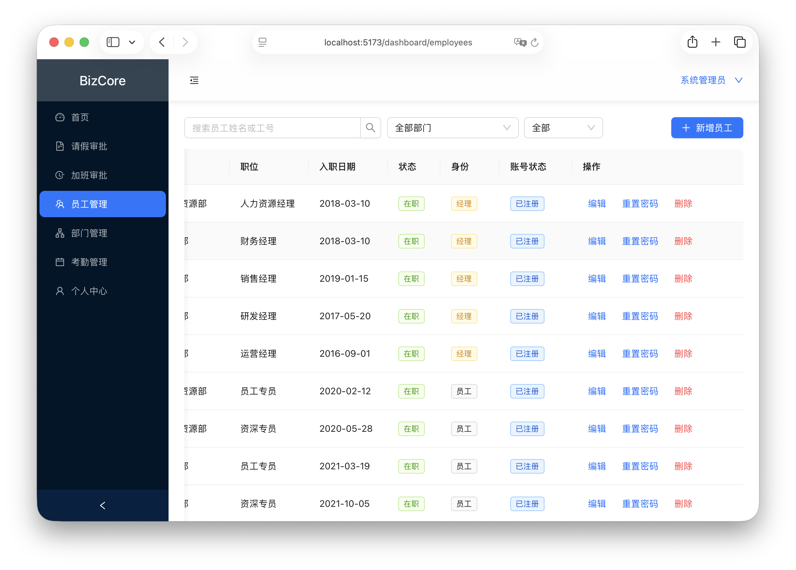
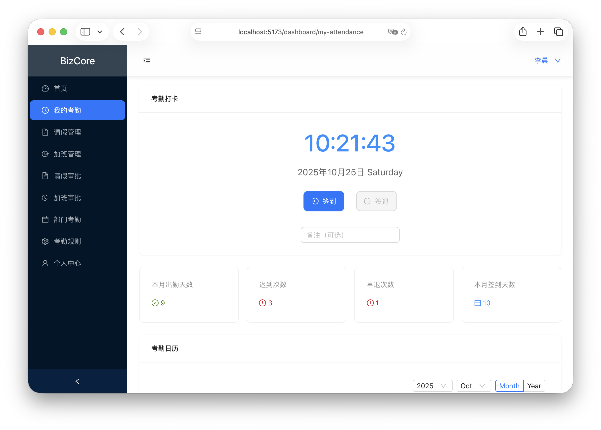

# BizCore 企业考勤与人事管理平台


BizCore 是一个围绕「企业考勤、请假、加班与部门管理」的全栈示例项目。后端基于 Spring Boot 3 + Spring Security 保护的 REST API，前端使用 Vue 3（Vite）与 Ant Design Vue 构建。项目内置多角色权限模型、JWT 鉴权（支持多设备 Session）、完整的考勤业务流程以及 MySQL 数据初始化脚本，适合二次开发或学习参考。

---

## ✨ 功能总览

| 模块 | 角色 | 主要能力 |
| ---- | ---- | -------- |
| 用户认证 | 全体 | 账号注册 / 登录、忘记密码（密保 + 手机校验）、JWT 多设备登录、刷新 / 登出 |
| 员工管理 | 管理员、经理 | 员工列表、信息维护、账号注册、密码重置、角色同步 |
| 部门管理 | 管理员 | 部门 CRUD、经理指定、部门统计 |
| 考勤 | 员工、经理 | 签到 / 签退、迟到早退判定、部门考勤查看、考勤统计 |
| 考勤规则 | 经理 | 上下班时间、宽限时间、弹性工作制配置 |
| 请假与加班 | 员工、经理 | 申请、审批、记录查询 |

后端 `/auth/refresh`、`/auth/logout`、`/users/reset-password` 等接口支持匿名访问，以配合前端找回密码流程，其余业务接口均需登录用户凭证。

## 系统界面
<div align="center">
  <figure style="display:inline-block;width:45%;margin:0 1%;text-align:center;">
    
    <figcaption><em>登录</em></figcaption>
  </figure>
  <figure style="display:inline-block;width:45%;margin:0 1%;text-align:center;">
    
    <figcaption><em>忘记密码</em></figcaption>
  </figure>
</div>
<div align="center">
  <figure style="display:inline-block;width:45%;margin:0 1%;text-align:center;">
    
    <figcaption><em>管理员首页</em></figcaption>
  </figure>
  <figure style="display:inline-block;width:45%;margin:0 1%;text-align:center;">
    
    <figcaption><em>请假审批</em></figcaption>
  </figure>
</div>
<div align="center">
  <figure style="display:inline-block;width:45%;margin:0 1%;text-align:center;">
    
    <figcaption><em>员工管理</em></figcaption>
  </figure>
  <figure style="display:inline-block;width:45%;margin:0 1%;text-align:center;">
    
    <figcaption><em>部门管理</em></figcaption>
  </figure>
</div>
<div align="center">
  <figure style="display:inline-block;width:45%;margin:0 1%;text-align:center;">
    
    <figcaption><em>个人中心</em></figcaption>
  </figure>
  <figure style="display:inline-block;width:45%;margin:0 1%;text-align:center;">
    
    <figcaption><em>我的考勤</em></figcaption>
  </figure>
</div>
<div align="center">
  <figure style="display:inline-block;width:45%;margin:0 1%;text-align:center;">
    
    <figcaption><em>部门考勤</em></figcaption>
  </figure>
  <figure style="display:inline-block;width:45%;margin:0 1%;text-align:center;">
    
    <figcaption><em>考勤规则</em></figcaption>
  </figure>
</div>

##  项目结构

```
BizCore
├── backend                  # Spring Boot 服务
│   ├── build.gradle         # Gradle 子模块配置
│   ├── src/main/java/com/achieveil/bizcore
│   │   ├── config           # 安全 & CORS & JWT 配置
│   │   ├── controller       # REST 控制器
│   │   ├── dto              # 请求 / 响应模型
│   │   ├── entity           # JPA 实体
│   │   ├── filter           # JWT 过滤器
│   │   ├── repository       # Spring Data 仓储
│   │   └── service          # 业务服务层
│   └── src/main/resources
│       └── db/schema.sql    # MySQL 初始化脚本（包含示例数据）
├── frontend                 # Vue 3 + Vite 前端
│   └── src
│       ├── api              # Axios 请求封装
│       ├── views            # 页面组件
│       └── router           # 前端路由表
└── README.md                # 当前文档
```

---

##  环境准备

| 组件 | 版本建议 |
| ---- | -------- |
| JDK  | 17 |
| Node | ≥ 18（建议 18.x） |
| MySQL| ≥ 8.0 |
| 构建工具 | Gradle Wrapper（项目已自带） |

若需运行 `schema.sql`，请确保 MySQL 以 UTF8MB4 字符集运行，并且有权限执行 `DROP DATABASE`.

---

##  数据库初始化

1. 启动本地 MySQL 服务。
2. 直接执行 `backend/src/main/resources/db/schema.sql`（会 **删除并重建** `bizcore` 数据库）：

   ```sql
   SOURCE /path/to/BizCore/backend/src/main/resources/db/schema.sql;
   ```

   - 脚本会创建所有业务表（含 `user_sessions` 等 JWT 相关表）。
   - 自动插入部门、员工、经理及管理员示例账号。

3. 默认数据库连接信息（可以通过环境变量覆盖）：

   | 属性 | 默认值 |
   | ---- | ------ |
   | `SPRING_DATASOURCE_URL` | `jdbc:mysql://localhost:3306/bizcore?...` |
   | `SPRING_DATASOURCE_USERNAME` | `root` |
   | `SPRING_DATASOURCE_PASSWORD` | `12345678` |
   | `SECURITY_JWT_SECRET` | `BizCoreChangeMeSecretKeyBizCoreChangeMeSecretKey`（建议部署时修改） |

### 示例账户（密码均为 `Passw0rd!`，安全问题答案为“蓝色”）

| 角色 | 用户名 | 说明 |
| ---- | ------ | ---- |
| 管理员 | `admin` | 全局管理 |
| 部门经理 | `li.manager`（人力） / `zhang.finance`（财务） / `wang.sales`（销售） / `chen.tech`（研发） / `liu.ops`（运营） | 已关联对应部门 |
| 部门员工 | `zhao.hr` / `sun.hr` ... `zhao.op` / `sun.op` | 每个部门 2 名员工，工号 `E00x0y` |

---

## 🛠️ 后端运行

```bash
cd backend
./gradlew bootRun
```

> 运行前确保 `application.yml` 中的数据库配置指向有效 MySQL 实例。  
> 使用 `./gradlew :backend:test` 可执行单元测试。

### 核心后端特性

- **Spring Security + JWT**：登录成功后返回 accessToken（1 小时）与 refreshToken（7 天），支持多设备同时登录，后台可吊销指定 session。
- **角色权限**：`ADMIN`、`MANAGER`、`EMPLOYEE` 三种角色通过 JWT 载荷注入 `ROLE_*` 权限。
- **REST 接口**：
  - `/auth/login | refresh | logout` —— 认证与 Token 轮换
  - `/users/*` —— 用户注册、找回密码、管理员重置
  - `/employees/*` —— 员工 CRUD、账号关联、角色调整
  - `/departments/*`、`/department-managers/*` —— 部门与经理配置
  - `/attendances/*` —— 考勤记录、统计
  - `/leave-requests/*`、`/overtime-requests/*` —— 请假与加班流程
  - `/department-attendance-rules/*` —— 部门考勤规则

所有接口返回统一的 `Result<T>` 响应结构（`code`、`message`、`data`）。

---

##  前端运行

```bash
cd frontend
npm install
npm run dev
```

默认 Vite 服务运行在 `http://localhost:5173`，并通过 `frontend/src/api/request.js` 中的 `baseURL = http://localhost:8080/api` 调用后端接口。

### 前端注意事项

- 找回密码流程包含 5 个步骤（用户名 → 密保 → 手机验证 → 新密码 → 完成），密码校验规则：**6-20 位，至少包含大小写字母与数字，可包含常见特殊符号**。
- 登录成功后会在 `localStorage` 中保存 `token`、`refreshToken`、`sessionId` 以及用户信息，Axios 拦截器自动注入 `Authorization` 头。
- 页面入口：
  - `/login` —— 登录
  - `/forgot-password` —— 找回密码
  - `/dashboard` —— 登录后工作台（根据角色展示不同菜单）

---

##  密码策略

- 后端密码加密使用 BCrypt；所有示例账号默认密码 `Passw0rd!`（满足大小写、数字、特殊符号）。
- 前端校验：`/^(?=.*[a-z])(?=.*[A-Z])(?=.*\d)[A-Za-z\d!@#$%^&*()_+\-={}\[\]:";'<>?,.\/]{6,20}$/`
- 忘记密码与管理员重置页同步使用上述规则。

---

##  常用命令速览

| 命令 | 说明 |
| ---- | ---- |
| `./gradlew :backend:test` | 执行后端测试 |
| `./gradlew bootRun` | 启动后端 |
| `npm run dev`（frontend） | 启动前端开发服务器 |
| `npm run build`（frontend） | 生产构建 |
| `mysql < schema.sql` | 初始化数据库数据 |

---

##  开发提示

- 如需禁用示例数据，可修改或注释 `schema.sql` 中的插入段落，或自行维护迁移脚本。
- 部署生产环境时，请设置安全的 `SECURITY_JWT_SECRET`、数据库账号、跨域策略等。
- 前端默认开启粒子背景渲染，如在低性能环境可在 `ForgotPassword.vue` / `Login.vue` 中移除相关代码。

---

##  许可

本项目用于学习与示例，可自由修改。若将其用于商业用途，请自行完善安全与审计措施。

---

© 2025 achieveil. All rights reserved.
